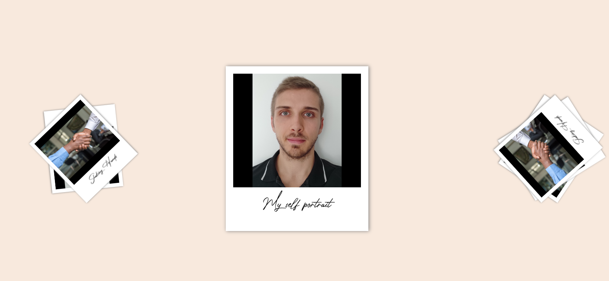

# Photo Slider with Polaroid Style

  This is a tiny project containing a ready-to-go slider section with a Polaroid effect.  
  Made with html/css and plain javascript.  
  It is supposed to be responsive, if you encounter issues after resizing/changing orientation try to reload first.  
  If troubles persist, please open an issue for I can fix it asap.  

## Live Demo

[Here](https://tolexia.github.io/polaroid-slider/)

## Previews

